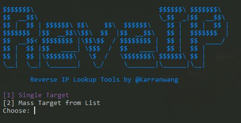

# 🔎 Reverse IP Lookup Tool

Simple and powerful Reverse IP Lookup tool.

Made with ❤️ by @karranwang Built using Python 3.  
Supports **single target** and **mass scanning** from a list of domains or IPs.

---

## 🚀 Features

- ✅ Reverse IP lookup from a **single domain or IP**
- ✅ Reverse IP lookup **massive** from `list.txt`
- ✅ Save results automatically to `result.txt`
- ✅ Multi-threaded for faster lookup
- ✅ Clean CLI interface
- ✅ Lightweight standalone executable (`.exe`) for Windows
- ✅ Using [RapidDNS](https://rapiddns.io/) API

---

## 📥 Installation

**Python Version:** `>= 3.7` (tested up to 3.13)

Clone or download this repository.

```bash
git clone https://github.com/karranwang/revip.git
```

```bash
cd revip
```

Install required packages:

```bash
pip install -r requirements.txt
```

## Usage

- [X] Termux or Linux
      
```bash
python3 revip.py
```

put your target on list.txt if selected menu mass

- [X] Windows

```bash
open dir on revip windows
```

```bash
run revip.exe
```

## Notes

This tool uses https://rapiddns.io/ public API.

If the API limits are exceeded, you may need to wait or use a proxy.

Educational purposes only. Use responsibly


## Demo




## Author

@karranwang

https://facebook.com/karranwangreal

https://instagram.com/karranwangreal


## License

This project is licensed under the MIT License.
